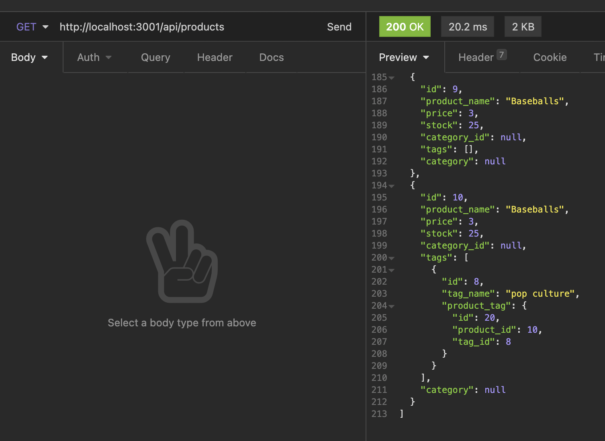
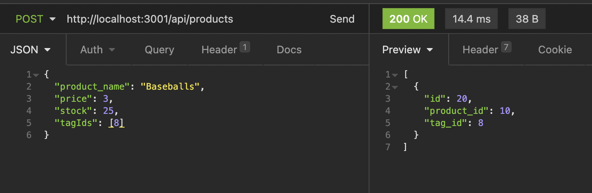

# E-Commerce Back End Project

## Table of Contents
            
- [Description](#Description)
- [Usage](#Usage)
- [Questions](#Questions)

### Description
For this project, I was tasked to create an application that allows the user to search a database for their all their products and check the name, price, the amount of stock for the items, and the category and tags associated with the products. They can also search for individual products within the database by searching by id.

They can also search for all of the tags and for tags by id as well as the categories and the categories by id. In addition to the search functionality, the user can also create, update, and delete tags, categories, and products. This allows the user to continue expanding their database, make edits to tags and products, as well as delete categories and tags that they want.

### Usage
To use this application, you need to open the project in the terminal and run the mysql shell and create the ecommerce_db database. Once this is done, while in the terminal you will need to run the command 'npm run seed' to seed the database. Then you run the command 'npm run watch' to start the server. When the server is running, you can open your insomnia core and start running get, put, post, and delete queries to the server. 

This video will show a step-by-step guide to how this is done: <a href="https://www.awesomescreenshot.com/video/4228286?key=d0cad76d170d975751b6b964faa4a7b3">Video Guide</a>

### Questions
My Github: https://github.com/morrisbianco

andrewbianco98@gmail.com: Please contact me through this E-mail address with any further questions that you may have.